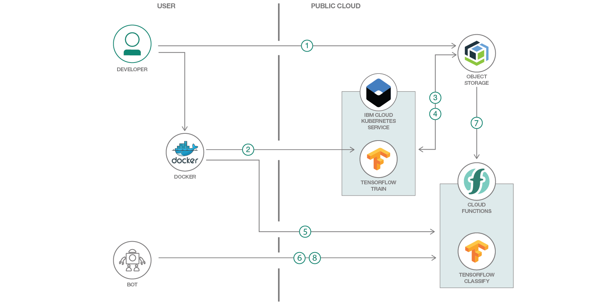

# Visual Recognition for Anki Cozmo with TensorFlow

The [Anki Cozmo](https://www.anki.com/cozmo) robot can recognize [faces](http://cozmosdk.anki.com/docs/generated/cozmo.faces.html) and [objects](http://cozmosdk.anki.com/docs/generated/cozmo.objects.html) like Cozmo's Power Cubes which have markers on them. This [project](https://github.com/nheidloff/visual-recognition-for-cozmo-with-tensorflow) contains sample code so that Cozmo can recognize other types of objects via [TensorFlow](https://www.tensorflow.org/).



## Flow
1. The developer takes pictures (possibly, but not necessarily with an Anzi Cozmo robot) and uploads them to IBM Cloud Object Storage.
2. The developer builds a Docker image containing TensorFlow and triggers Kubernetes to run the “training” container.
3. The training container loads images from Cloud Object Storage.
4. TensorFlow trains the neural network and uploads the trained net back to Cloud Object Storage.
5. The developer builds a “classifier” Docker image that contains TensorFlow and uses it to create an IBM Cloud Functions action/sequence.
6. The developer triggers the Cloud Function with an image, either from the sample web app or from the robot.
7. The pre-trained TensorFlow graph is retrieved from Cloud Object Storage.
8. The image is classified and the result is returned.

## Included components
* [Cloud Object Storage](https://console.bluemix.net/catalog/services/object-storage): Build and deliver cost effective apps and services with high reliability and fast speed to market in an unstructured cloud data store.
* [IBM Cloud Kubernetes Service](https://console.bluemix.net/docs/containers/container_index.html): IBM Cloud Kubernetes Service manages highly available apps inside Docker containers and Kubernetes clusters on the IBM Cloud.
* [OpenWhisk](https://console.ng.bluemix.net/openwhisk): Execute code on demand in a highly scalable, serverless environment.
* [Tensorflow](https://www.tensorflow.org/): An open source software library for numerical computation using data flow graphs.

## Featured technologies
* [Cloud](https://www.ibm.com/developerworks/learn/cloud/): Accessing computer and information technology resources through the Internet.
* [Serverless](https://www.ibm.com/cloud-computing/bluemix/openwhisk): An event-action platform that allows you to execute code in response to an event.

# Watch the Videa

Watch the [video](https://www.youtube.com/user/nheidloff) and check out the [slides](https://www.slideshare.net/niklasheidloff/visual-recognition-with-anki-cozmo-and-tensorflow-84050740) to see how Cozmo can recognize three different toys:

[](https://www.slideshare.net/niklasheidloff/visual-recognition-with-anki-cozmo-and-tensorflow-84050740)

# Steps

## Prerequisites

Install the [Cozmo SDK](http://cozmosdk.anki.com/docs/initial.html).

Get a free [IBM Cloud lite](https://console.bluemix.net/registration/) account.

Install the [IBM Cloud](https://console.bluemix.net/docs/cli/index.html#downloads) CLI.

Install [Docker](https://docs.docker.com/engine/installation/) and register for an account on [DockerHub](https://hub.docker.com/).

Create a free/lite [Kubernetes cluster](https://console.bluemix.net/containers-kubernetes/catalogCluster).

Install the [Kubernetes CLI](https://kubernetes.io/docs/tasks/tools/install-kubectl/).


## 1. Take Pictures

Take pictures of an object by invoking these commands and circling Cozmo around the object for 10 seconds. Replace 'deer' with a name for your object:

```sh
$ git clone https://github.com/IBM/visual-recognition-for-cozmo-with-tensorflow.git
$ cd visual-recognition-for-cozmo-with-tensorflow/1-take-pictures
$ python3 take-pictures.py deer
```


## 2. Upload Pictures

Create an instance of [IBM Cloud Object Storage](https://console.bluemix.net/catalog/services/cloud-object-storage).

Create a service credential, then copy/remember the fields ‘apikey' and 'resource_instance_id' from the credentials. Paste them in [upload-pictures.py](2-upload-pictures/upload-pictures.py).

Invoke these commands:

```sh
$ cd visual-recognition-for-cozmo-with-tensorflow/2-upload-pictures
$ pip3 install ibm-cos-sdk
$ python3 upload-pictures.py
```


## 3. Train the Model

Paste the values of ‘aws_access_key_id’ and ‘aws_secret_access_key’ from your IBM COS credentials in [train.yml](3-train/train.yml).

Replace 'nheidloff' with your DockerHub name and run these commands:

```sh
$ cd visual-recognition-for-cozmo-with-tensorflow/3-train
$ docker build -t nheidloff/tensorflow-openwhisk-train-cozmo:latest .
$ docker push nheidloff/tensorflow-openwhisk-train-cozmo:latest
$ ibmcloud login -a api.ng.bluemix.net
$ ibmcloud cs cluster-config mycluster
$ export KUBECONFIG=/Users/nheidlo.....
$ kubectl apply -f train.yml 
```

After this you should see the files 'retrained_graph_cozmo.pb' and 'retrained_labels_cozmo.txt' in the 'tensorflow' container in IBM Cloud Object Storage.

Read Ansgar's [blog](https://ansi.23-5.eu/2017/11/image-recognition-with-tensorflow-training-on-kubernetes/) for more details.


## 4. Deploy the Model to OpenWhisk

Paste the values of ‘apikey’ and ‘resource_instance_id’ in [classifier.py](4-classify/classifier.py).

Replace 'nheidloff' with your DockerHub name and run these commands:

```sh
$ cd visual-recognition-for-cozmo-with-tensorflow/4-classify
$ docker build -t nheidloff/tensorflow-openwhisk-classifier-cozmo:latest .
$ docker push nheidloff/tensorflow-openwhisk-classifier-cozmo:latest
$ cd visual-recognition-for-cozmo-with-tensorflow/4-classify/openwhisk-api
$ ibmcloud login -a api.ng.bluemix.net
$ ibmcloud target -o <your-organization> -s <your-space>
$ ibmcloud plugin install Cloud-Functions -r Bluemix
$ ibmcloud wsk package create visualRecognitionCozmo
$ ibmcloud wsk action create visualRecognitionCozmo/tensorflow-classify --docker nheidloff/tensorflow-openwhisk-classifier-cozmo:latest
$ npm install
$ sh ./deploy.sh
$ ibmcloud wsk action create --sequence visualRecognitionCozmo/classifyAPI visualRecognitionCozmo/classifyImage,visualRecognitionCozmo/tensorflow-classify --web raw
```


## 5. Test the Model via the Web Application

In the [IBM Cloud Functions web console](https://console.bluemix.net/openwhisk/actions) choose your sequence (named `classifyAPI`) and select 'Endpoints' from the menu on the left. From there copy the HTTP Method Public URL to the clipboard. Create a new file '.env' in the '5-test-in-web-app' directory. See [.env-template](5-test-in-web-app/.env-template) for an example. Paste the URL in this file.

Run these commands:

```sh
$ cd visual-recognition-for-cozmo-with-tensorflow/5-test-in-web-app
$ npm install
$ npm start
```
  
Open the web application via [http://localhost:3000/](http://localhost:3000/).

Optionally: In order to deploy the application to the IBM Cloud, change the application name in [manifest.yml](5-test-in-web-app/manifest.yml) to something unique and run these commands:

```sh
$ ibmcloud login -a api.ng.bluemix.net
$ ibmcloud target -o <your-organization> -s <your-space>
$ ibmcloud cf push
```

Open the web application via [http://your-application-name.mybluemix.net/](http://your-application-name.mybluemix.net/).


## 6. Test Visual Recognition with Cozmo

Paste the value of your sequence endpoint from step 5 into [find.py](6-play-with-cozmo/find.py).

Place your object(s) in a circle around Cozmo and run these commands. Replace 'deer' with a name for your object:

```sh
$ cd visual-recognition-for-cozmo-with-tensorflow/6-play-with-cozmo
$ python3 find.py deer
```

# Links

* [Sample Application to classify Images with TensorFlow and OpenWhisk](https://heidloff.net/article/visual-recognition-tensorflow)
* [Image Recognition with TensorFlow training on Kubernetes](https://ansi.23-5.eu/2017/11/image-recognition-with-tensorflow-training-on-kubernetes/)
* [Image Recognition with TensorFlow classification on OpenWhisk](https://ansi.23-5.eu/2017/11/image-recognition-tensorflow-classification-openwhisk/)
* [Visual Recognition with TensorFlow and OpenWhisk](http://heidloff.net/article/visual-recognition-tensorflow-openwhisk)

# License
[Apache 2.0](LICENSE)
